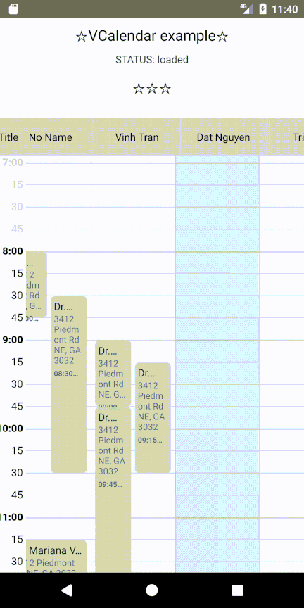

# react-native-events-week-calendar

## Getting started

`$ npm install react-native-events-week-calendar --save`

### Mostly automatic installation

`$ react-native link react-native-events-week-calendar`

## Images


## Usage
```javascript
import { VCalendar } from 'react-native-events-week-calendar';

...
<VCalendar
          onNewEvent={this.onNewEvent}
          onClickEvent={this.onClickEvent}
          columnHeaders={headers}
          title="My Title"
          hourStart={8}
          hourEnd={17}
          showHourStart={7}
        />
...
```
## Props
* **`onNewEvent`** _(function)_ callback e.g. {"Title": "Column title", "hours": {"from": "8:15", "to": "8:30"}, "index": 1}
* **`onClickEvent`** _(function)_ callback e.g. {"title": "Dr. Mariana Joseph", "summary": "3412 Piedmont Rd NE, GA 3032", "start": "2020-09-07 09:15:00", "end": "2020-09-07 10:30:00", "Column-index": 1}
* **`title`** The left top cell
* **`hourStart`** The working hour start, e.g. 8:00
* **`hourEnd`** The working hour end, e.g. 20:00
* **`showHourStart`** The start hour to display, e.g. 7. It means that user can see the top hour of calendar
* **`columnHeaders`** _(array)_
```js
[
        {
          Title: "No Name",
          events: [
            {
              start: '2020-09-07 08:00:00',
              end: '2020-09-07 08:45:00',
              title: 'Dr. Mariana Lisa',
              summary: '3412 Piedmont Rd NE, GA 3032',
              color: 'green',
            },
           ...
            {
              start: '2020-09-07 11:15:00',
              end: '2020-09-07 12:30:00',
              title: 'Dr. Tran Vinh',
              summary: '290 Nguyen Van Troi, Ho Chi Minh, Viet Nam',
            },]
        },
        ...
]
```
## TODO: 
- [x] Horizontal scroll, vertical scroll
- [ ] Drag/Drop Events
